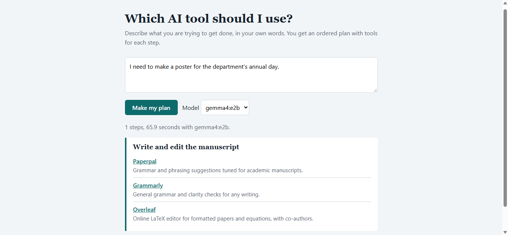

# Which AI tool should I use?

A small local tool built for a professor friend who found it hard to pick AI tools for research, notes and teaching.

She describes her goal in plain words. A local open model (Gemma 4, through Ollama) decides which kinds of work the goal involves. The page then lists tools for each step from a hand-written catalog. The model never names tools itself, so it cannot invent one. Nothing she types leaves her laptop.

## Run it

You need Ollama and Python installed.

1. `ollama pull gemma4:e2b`
2. In one terminal: `ollama serve`
3. In another terminal, in this folder: `python serve.py`
4. Open http://localhost:8000/ai-tool-guide.html

Switch to `gemma4:e4b` with the dropdown for better answers, but slower.

## Limits

- The tool catalog is written by hand and covers 21 tools, aimed at economics research and teaching. Tool descriptions may go out of date.
- I did not run a formal evaluation, so I make no accuracy claims.
- On a laptop with 12 GB RAM and no dedicated graphics card, answers take a while.

## Edit the catalog

The tool list is the `CATALOG` array in `ai-tool-guide.html`.

## License

MIT
